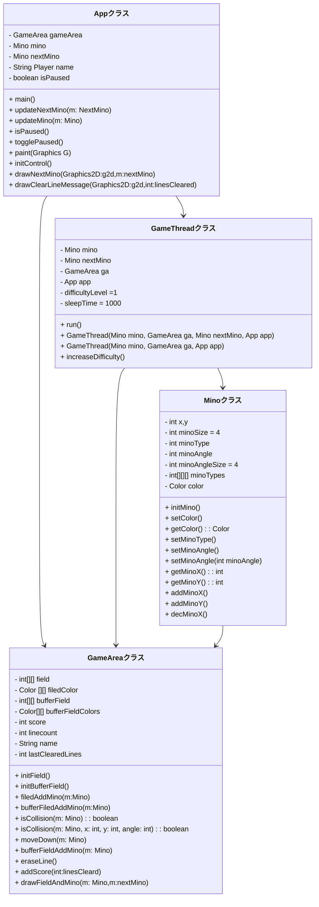

```mermaid
classDiagram
    class Appクラス {
        - GameArea gameArea
        - Mino mino
        - Mino nextMino
        - String Player name
        - boolean isPaused
        + main()
        + updateNextMino(m: NextMino)
        + updateMino(m: Mino)
        + isPaused()
        + togglePaused()
        + paint(Graphics G)
        + initControl()
        + drawNextMino(Graphics2D:g2d,m:nextMino)
        + drawClearLineMessage(Graphics2D:g2d,int:linesCleared)
    }

    class GameAreaクラス {
        - int[][] field
        - Color [][] filedColor
        - int[][] bufferField
        - Color[][] bufferFieldColors
        - int score
        - int linecount
        - String name
        - int lastClearedLines
        + initField()
        + initBufferField()
        + filedAddMino(m:Mino)
        + bufferFiledAddMino(m:Mino)
        + isCollision(m: Mino) : boolean
        + isCollision(m: Mino, x: int, y: int, angle: int) : boolean
        + moveDown(m: Mino)
        + bufferFieldAddMino(m: Mino)
        + eraseLine()
        + addScore(int:linesCleard)
        + drawFieldAndMino(m: Mino,m:nextMino)
    }

    class GameThreadクラス {
        - Mino mino
        - Mino nextMino
        - GameArea ga
        - App app
        - difficultyLevel =1
        - sleepTime = 1000
        + run()
        + GameThread(Mino mino, GameArea ga, Mino nextMino, App app)
        + GameThread(Mino mino, GameArea ga, App app)
        + increaseDifficulty()

    }

    class Minoクラス {
        - int x,y
        - int minoSize = 4
        - int minoType
        - int minoAngle
        - int minoAngleSize = 4
        - int[][][] minoTypes
        - Color color
        + initMino()
        + setColor()
        + getColor() : Color
        + setMinoType()
        + setMinoAngle()
        + setMinoAngle(int minoAngle)
        + getMinoX() : int
        + getMinoY() : int
        + addMinoX()
        + addMinoY()
        + decMinoX()
    }

    Appクラス  --> GameThreadクラス
    Appクラス  --> GameAreaクラス
    GameThreadクラス --> GameAreaクラス
    GameThreadクラス  -->  Minoクラス
    Minoクラス  -->  GameAreaクラス
```
