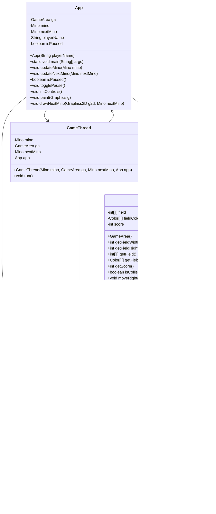

```mermaid
classDiagram
    class App {
        -GameArea ga
        -Mino mino
        -Mino nextMino
        -String playerName
        -boolean isPaused
        +App(String playerName)
        +static void main(String[] args)
        +void updateMino(Mino mino)
        +void updateNextMino(Mino nextMino)
        +boolean isPaused()
        +void togglePause()
        -void initControls()
        +void paint(Graphics g)
        -void drawNextMino(Graphics2D g2d, Mino nextMino)
    }

    class GameArea {
        -int[][] field
        -Color[][] fieldColors
        -int score
        +GameArea()
        +int getFieldWidth()
        +int getFieldHight()
        +int[][] getField()
        +Color[][] getFieldColors()
        +int getScore()
        +boolean isCollison(Mino mino, int x, int y, int angle)
        +void moveRight(Mino mino)
        +void moveLeft(Mino mino)
        +void moveDown(Mino mino)
        +void rotation(Mino mino)
    }

    class Mino {
        -Random rand
        -int minoSize
        -int[][][] minoTypes
        -int x
        -int y
        -int minoType
        -int minoAngle
        -int minoAngleSize
        -Color color
        +Mino()
        +void initMino()
        +Color getColor()
        +int[][][] getMino()
        +int getMinoSize()
        +int getMinoAngleSize()
        +int getMinoX()
        +int getMinoY()
        +void setMinoX(int x)
        +void setMinoY(int y)
        +void addMinoX()
        +void addMinoY()
        +void decMinoX()
        +int getMinoAngle()
        +int getMinoType()
        -void setMinoType()
        -void setMinoAngle()
        -void setMinoAngle(int minoAngle)
        -void randSet()
    }

    class GameThread {
        -Mino mino
        -GameArea ga
        -Mino nextMino
        -App app
        +GameThread(Mino mino, GameArea ga, Mino nextMino, App app)
        +void run()
    }

    App --> GameArea
    App --> Mino
    App --> GameThread
    GameThread --> Mino
    GameThread --> GameArea
    GameThread --> App
    GameArea --> Mino
```
