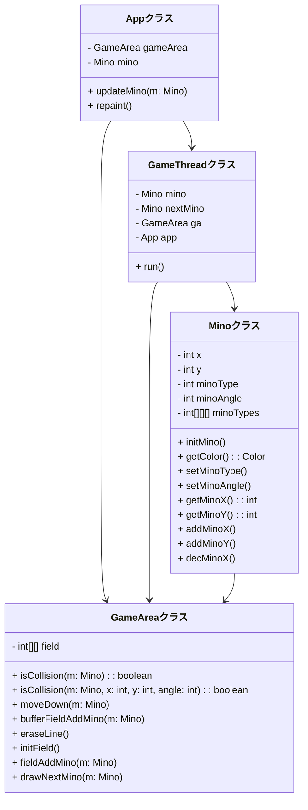

```mermaid
classDiagram
    class Appクラス {
        - GameArea gameArea
        - Mino mino
        + updateMino(m: Mino)
        + repaint()
    }

    class GameAreaクラス {
        - int[][] field
        + isCollision(m: Mino) : boolean
        + isCollision(m: Mino, x: int, y: int, angle: int) : boolean
        + moveDown(m: Mino)
        + bufferFieldAddMino(m: Mino)
        + eraseLine()
        + initField()
        + fieldAddMino(m: Mino)
        + drawNextMino(m: Mino)
    }

    class GameThreadクラス {
        - Mino mino
        - Mino nextMino
        - GameArea ga
        - App app
        + run()
    }

    class Minoクラス {
        - int x
        - int y
        - int minoType
        - int minoAngle
        - int[][][] minoTypes
        + initMino()
        + getColor() : Color
        + setMinoType()
        + setMinoAngle()
        + getMinoX() : int
        + getMinoY() : int
        + addMinoX()
        + addMinoY()
        + decMinoX()
    }

    Appクラス  --> GameThreadクラス
    Appクラス  --> GameAreaクラス
    GameThreadクラス --> GameAreaクラス
    GameThreadクラス  -->  Minoクラス
    Minoクラス  -->  GameAreaクラス
```
