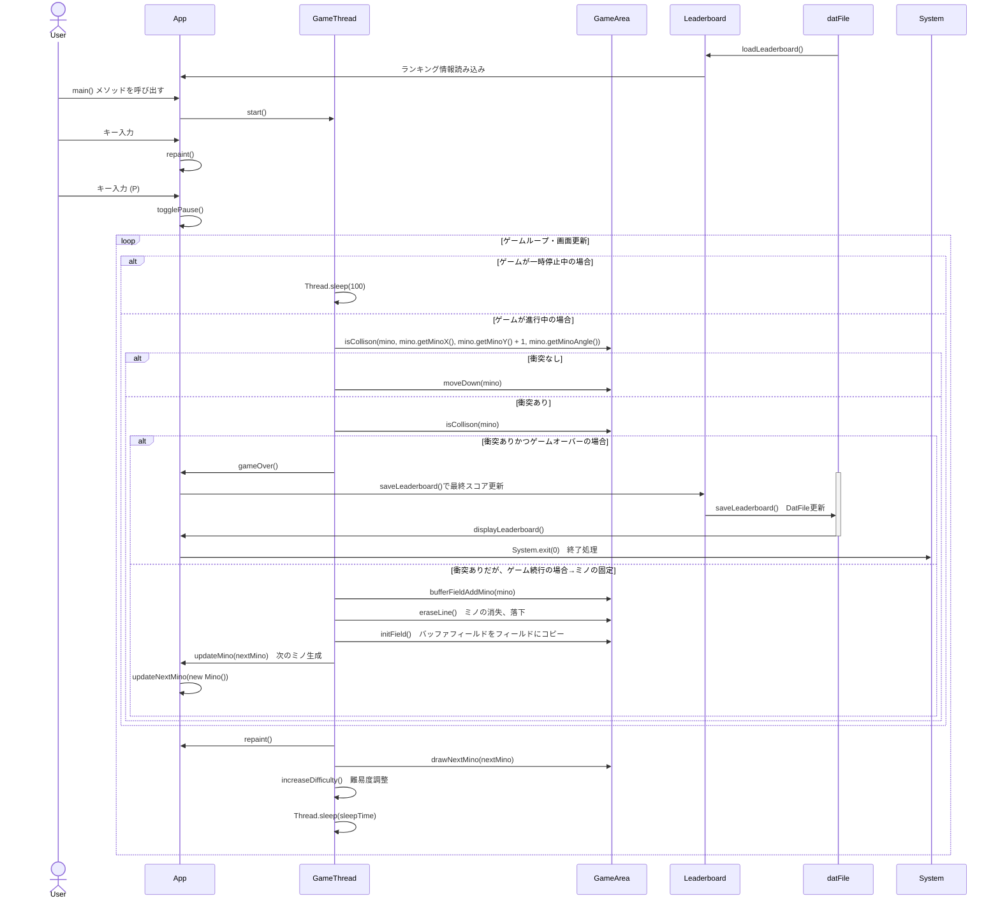

```mermaid


sequenceDiagram

    Actor User
    participant App
    participant GameThread
    participant GameArea
    participant Leaderboard
    participant datFile

    %% ゲーム開始
    datFile ->>Leaderboard :loadLeaderboard()
    Leaderboard ->>App :ランキング情報読み込み
    User->>App: main() メソッドを呼び出す
    App->>GameThread: start()

    %% ミノの操作
    User->>App: キー入力
    App->>App: repaint()


    %% 一時停止
    User->>App: キー入力 (P)
    App->>App: togglePause()

    %% ゲームスレッドの処理
    loop ゲームループ・画面更新
        alt ゲームが一時停止中の場合
            GameThread->>GameThread: Thread.sleep(100)
        else ゲームが進行中の場合
            GameThread->>GameArea: isCollison(mino, mino.getMinoX(), mino.getMinoY() + 1, mino.getMinoAngle())
            alt 衝突なし
                GameThread->>GameArea: moveDown(mino)
            else 衝突あり
                GameThread->>GameArea: isCollison(mino)
                alt 衝突ありかつゲームオーバーの場合
                    GameThread->>App: gameOver()
                    Activate datFile
                    App->>Leaderboard: saveLeaderboard()で最終スコア更新　
                    Leaderboard->>datFile :saveLeaderboard()　DatFile更新
                    
                    datFile->>App: displayLeaderboard()
                    deactivate datFile
                    App->>System: System.exit(0)　終了処理
                else 衝突ありだが、ゲーム続行の場合→ミノの固定
                    GameThread->>GameArea: bufferFieldAddMino(mino)
                    GameThread->>GameArea: eraseLine()　ミノの消失、落下
                    GameThread->>GameArea: initField()　バッファフィールドをフィールドにコピー
                    GameThread->>App: updateMino(nextMino)　次のミノ生成
                    App->>App: updateNextMino(new Mino())
                end
            end
        end
        GameThread->>App: repaint()
        GameThread->>GameArea: drawNextMino(nextMino)　
        GameThread->>GameThread: increaseDifficulty()　難易度調整
        GameThread->>GameThread: Thread.sleep(sleepTime)　
    end
```
