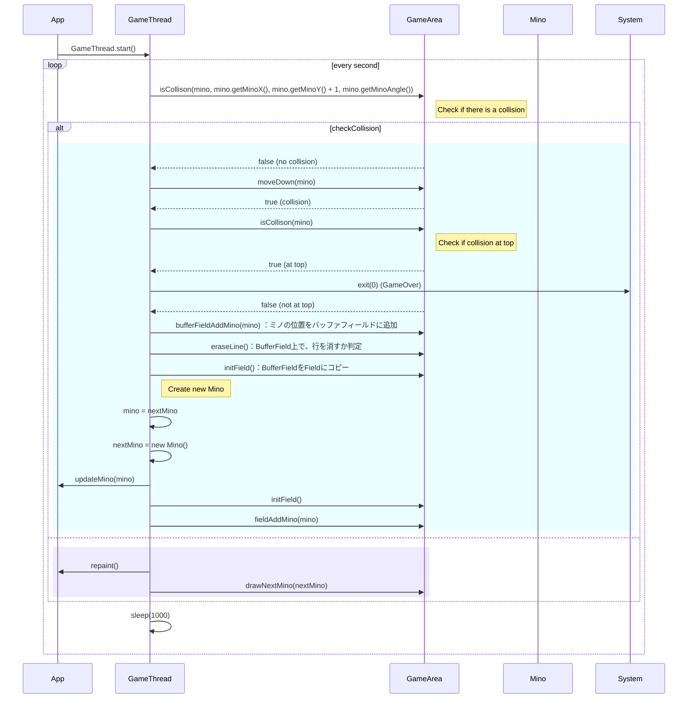

```mermaid

sequenceDiagram
    participant App
    participant GameThread
    participant GameArea
    participant Mino
    
    participant System
     App->>GameThread : GameThread.start()
    loop every second
        GameThread ->> GameArea: isCollison(mino, mino.getMinoX(), mino.getMinoY() + 1, mino.getMinoAngle())
        note right of GameArea: Check if there is a collision
        
        alt checkCollision 
            rect rgba(157 , 252, 254, 0.2)
            GameArea -->> GameThread: false (no collision)
            GameThread ->> GameArea: moveDown(mino)
            
            GameArea -->> GameThread: true (collision)
            GameThread ->> GameArea: isCollison(mino)
            
            note right of GameArea: Check if collision at top
            GameArea -->> GameThread: true (at top)
            GameThread ->> System: exit(0) (GameOver)
            
            GameArea -->> GameThread: false (not at top)
            GameThread ->> GameArea: bufferFieldAddMino(mino) ：ミノの位置をバッファフィールドに追加
            GameThread ->> GameArea: eraseLine()：BufferField上で、行を消すか判定
            GameThread ->> GameArea: initField()：BufferFieldをFieldにコピー
            
            note right of GameThread: Create new Mino
            GameThread ->> GameThread: mino = nextMino
            GameThread ->> GameThread: nextMino = new Mino()
            GameThread ->> App: updateMino(mino)

            GameThread ->> GameArea: initField()
            GameThread ->> GameArea: fieldAddMino(mino)
            end
        else
        rect rgba(167 ,153, 245,0.2)
        GameThread ->> App: repaint()
        GameThread ->> GameArea: drawNextMino(nextMino)
        end
        end
        GameThread ->> GameThread: sleep(1000)
    end
```
