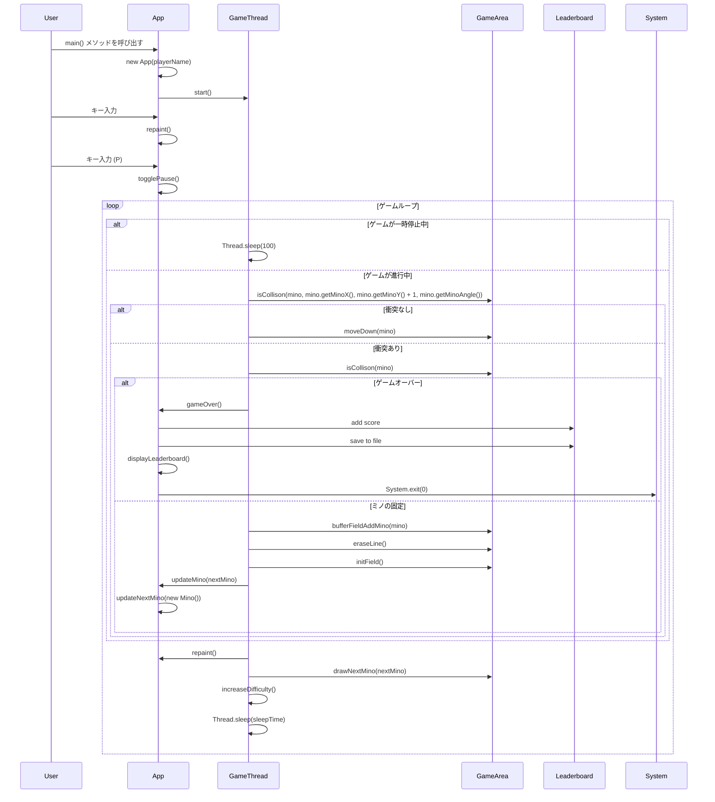

```mermaid

sequenceDiagram
    participant User
    participant App
    participant GameThread
    participant GameArea
    participant Leaderboard

    %% ゲーム開始
    User->>App: main() メソッドを呼び出す
    App->>App: new App(playerName)
    App->>GameThread: start()

    %% ミノの操作
    User->>App: キー入力
    App->>App: repaint()


    %% 一時停止
    User->>App: キー入力 (P)
    App->>App: togglePause()

    %% ゲームスレッドの処理
    loop ゲームループ
        alt ゲームが一時停止中
            GameThread->>GameThread: Thread.sleep(100)
        else ゲームが進行中
            GameThread->>GameArea: isCollison(mino, mino.getMinoX(), mino.getMinoY() + 1, mino.getMinoAngle())
            alt 衝突なし
                GameThread->>GameArea: moveDown(mino)
            else 衝突あり
                GameThread->>GameArea: isCollison(mino)
                alt ゲームオーバー
                    GameThread->>App: gameOver()
                    App->>Leaderboard: add score
                    App->>Leaderboard: save to file
                    App->>App: displayLeaderboard()
                    App->>System: System.exit(0)
                else ミノの固定
                    GameThread->>GameArea: bufferFieldAddMino(mino)
                    GameThread->>GameArea: eraseLine()
                    GameThread->>GameArea: initField()
                    GameThread->>App: updateMino(nextMino)
                    App->>App: updateNextMino(new Mino())
                end
            end
        end
        GameThread->>App: repaint()
        GameThread->>GameArea: drawNextMino(nextMino)
        GameThread->>GameThread: increaseDifficulty()
        GameThread->>GameThread: Thread.sleep(sleepTime)
    end
```
